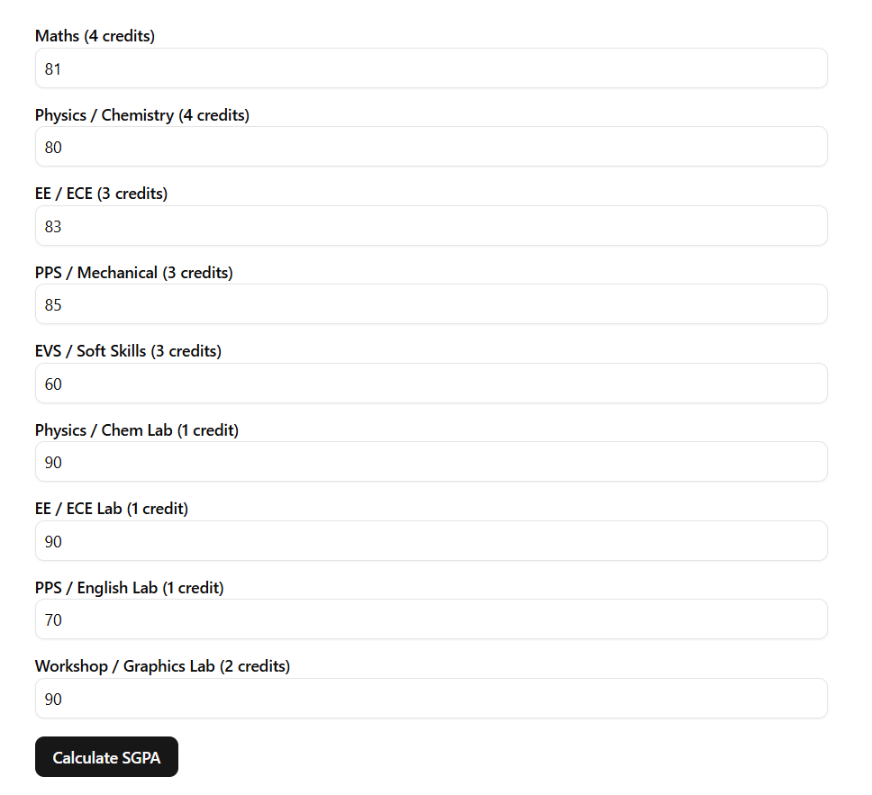
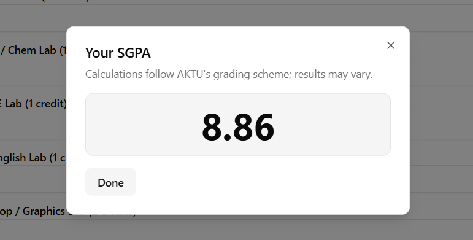
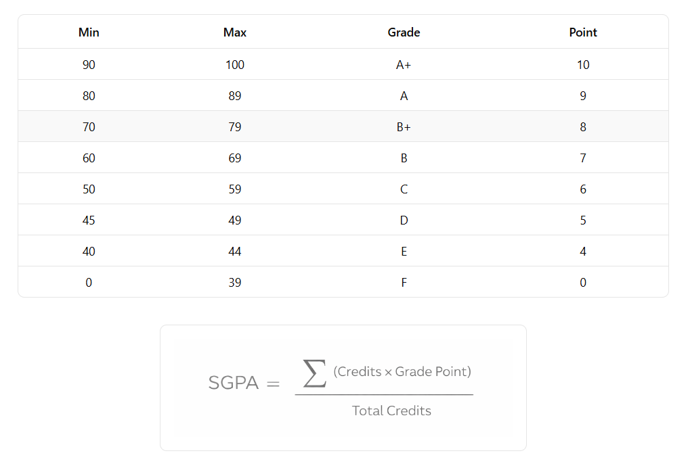

# SGPA Calculator
A web-based SGPA calculator for IET Lucknow students following AKTU’s grading scheme.

## Problem
Students calculate SGPA manually and are often confused about the grading scheme and formulae which leads to frequent mistakes and inconsistency.

## Solution
This application provides a simple form to input your marks in each subject and computes SGPA using AKTU’s official grading logic.

## Features
- Accurate SGPA Calculation
- Grading Scheme
- SGPA Calculation Formula
- Modern and Responsive UI
- Input validation for marks
- Unit-tested core calculation logic

## Tech Stack
- **Next.js:** React framework for building a fast, production-ready web app.
- **TypeScript:** Ensures type safety and prevents invalid states.
- **shadcn/ui:** Accessible and consistent UI components.
- **Zod + react-hook-form:** Type-safe form validation with minimal re-renders.
- **Vitest:** Unit testing for core calculation logic.
- **Vercel:** Deployment and CI/CD platform along with real-time analytics.

## Getting Started
### Prerequisties
- Node.js >= 18

### Installation
```bash
git clone https://github.com/thisisatulkumar/iet-lko-cgpa-calculator.git
cd iet-lko-cgpa-calculator
npm install
```

### Running Locally
```
npm run dev
```

## Usage
1. Enter marks for each subject in the input fields.
2. Grades are automatically mapped according to AKTU’s grading scheme.
3. SGPA is calculated in real time based on subject credits and grade points.
4. The final SGPA is displayed in a dialog box.

### Example




## Testing
The project includes unit and component tests to ensure correctness of the core grading logic and UI behavior.

- **Pure utility functions** are unit tested to verify grade mapping and SGPA calculation logic, including boundary and invalid input cases.
- **Form behavior** is tested to ensure inputs behave correctly and results are rendered after user interaction.
- **Input auto-advance logic** is tested in isolation to validate focus behavior based on user input.

Tests are written using **Vitest** and **@testing-library/react**.

To run the test suite:
```bash
npm run test
```

## Design Decisions
- Core SGPA calculation logic is implemented as pure utility functions to keep it deterministic, testable, and independent of the UI.
- Form state and validation are handled using react-hook-form with Zod schemas to ensure type-safe and predictable user input handling.
- UI components are built using shadcn/ui to maintain accessibility and visual consistency while retaining full control over styling.
- Business logic and presentation are separated to make the codebase easier to reason about and maintain.
- Unit tests are written for both utility functions and critical UI interactions to catch regressions early.

## Limitations
- Only for first-year students
- No data persistence

## Future Improvements
- Extend support to multiple academic years and branches.
- Add multi-semester support to compute cumulative CGPA.
- Persist user data across sessions using a backend.
- Allow configuration of grading schemes for different universities.
- Improve result visualization with charts or summaries.

## LICENSE
This project is licensed under the MIT License.
